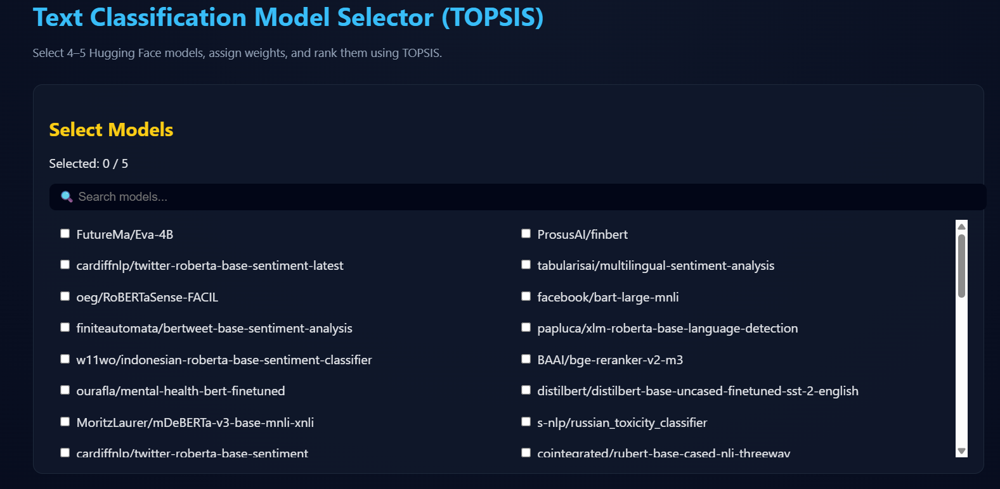
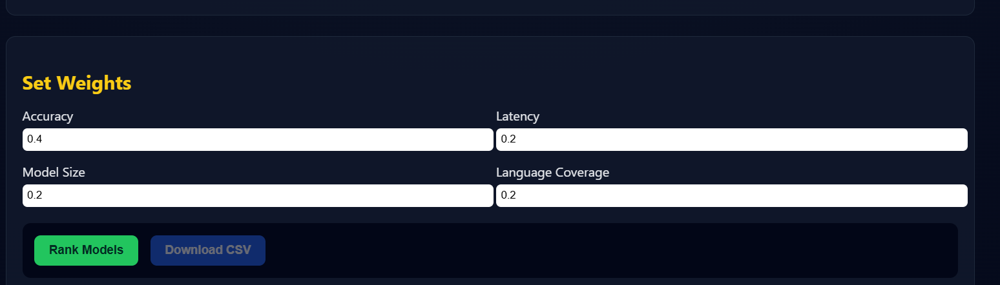
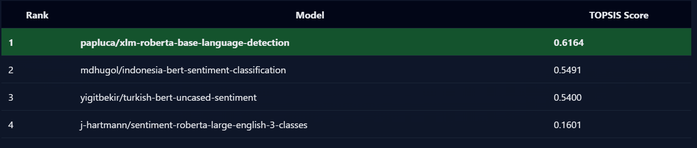
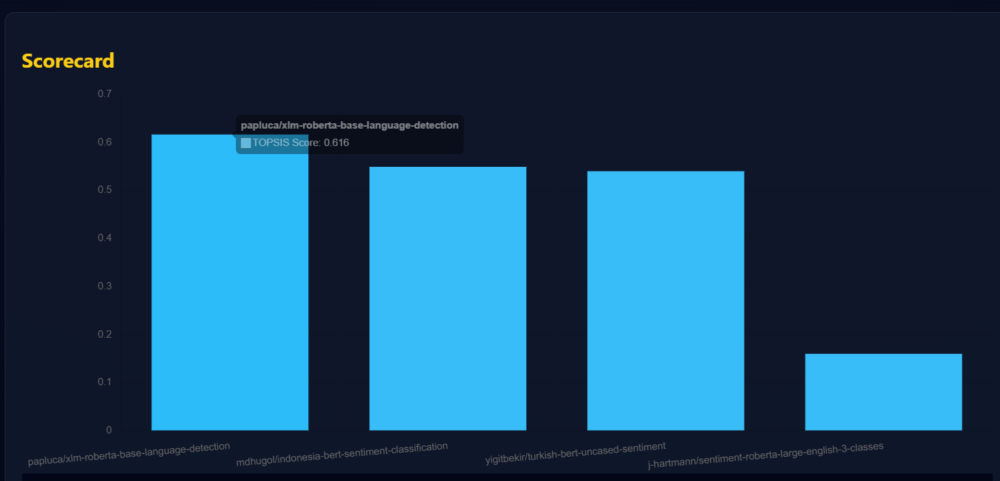

## TOPSIS-Based Text Classification Model Selector
A full-stack decision-support system that ranks Hugging Face text classification models using the TOPSIS (Technique for Order Preference by Similarity to Ideal Solution) multi-criteria decision-making algorithm.

---------------------------------------------------------------------------------------------

## Problem Statement

Hugging Face hosts thousands of text classification models, but:
No unified benchmark exists
Model selection depends on multiple conflicting criteria
Accuracy, latency, size, and language coverage trade off against each other
Goal: Provide a systematic, explainable way to select the best model.

Solution
This project applies TOPSIS, a proven MCDM algorithm, to rank models based on user-defined weights across multiple criteria.

---------------------------------------------------------------------------------------------

## Features
```
Select 4–5 models for fair comparison
Custom weight assignment
TOPSIS ranking engine
Interactive bar chart visualization
CSV export of results
Clean, responsive frontend
REST API with FastAPI
Dockerized backend
```
---------------------------------------------------------------------------------------------

## Project Architecture
```
topsis_model_selector/
│
├── backend/
│   ├── app.py              
|   |   # FastAPI application
│   ├── hf_utils.py         
|   |   # Hugging Face model + metadata logic
│   ├── topsis_core.py      
|   |  # TOPSIS implementation
│   ├── requirements.txt
│   └── Dockerfile
│
├── frontend/
│   ├── index.html
│   ├── style.css
│   └── script.js
|
├── screenshots/
│   ├── home.png
│   ├── model-selection.png
│   ├── weights.png
│   └── bar-chart.png
│
└── README.md
```

Backend API Endpoints
```
- Get Available Models
- Rank Models
```
---------------------------------------------------------------------------------------------

---

## End-to-End Workflow with Core Logic
This section explains how the system works end-to-end, linking the frontend flow, backend logic, and the TOPSIS algorithm.

###  Step 1: Home & System Entry

The user is introduced to the goal of the system: selecting the best text classification model using TOPSIS.

---

###  Step 2: Model Discovery & Selection
- Models are fetched dynamically from Hugging Face using the backend API.
- Users search and select **4–5 models** for fair comparison.
- Selection limits are enforced on both frontend and backend.

---

###  Step 3: Criteria Weight Assignment

Users assign weights to:
- Accuracy
- Latency
- Model Size
- Language Coverage  
These weights represent user preferences and are used during TOPSIS computation.

---

###  Step 4: Metadata Generation (Backend Logic)
Since Hugging Face does not provide standardized accuracy or latency benchmarks, the backend generates **heuristic metadata** for each selected model.
Heuristic assumptions include:
- Larger models tend to be more accurate but slower
- Smaller models are faster
- Multilingual models support more languages
This metadata forms the **decision matrix** for TOPSIS.

---

###  Step 5: TOPSIS Computation

The system applies the TOPSIS algorithm by:
1. Normalizing the decision matrix
2. Applying user-defined weights
3. Identifying ideal best and worst solutions
4. Computing distances and TOPSIS scores
5. Ranking models based on closeness to the ideal solution

---

###  Step 6: Ranking Results

The ranked list of models is displayed along with TOPSIS scores.  
The best-performing model is highlighted automatically.

---

###  Step 7: Visual Analytics

A bar chart visualizes TOPSIS scores, enabling quick and intuitive comparison.

---

###  Step 8: Export Results
Users can download the ranking results as a CSV file for reporting and further analysis.

---

###  System Flow Summary
Fetch models → Select models → Assign weights → Generate metadata → Apply TOPSIS → Display ranking → Export results

---


